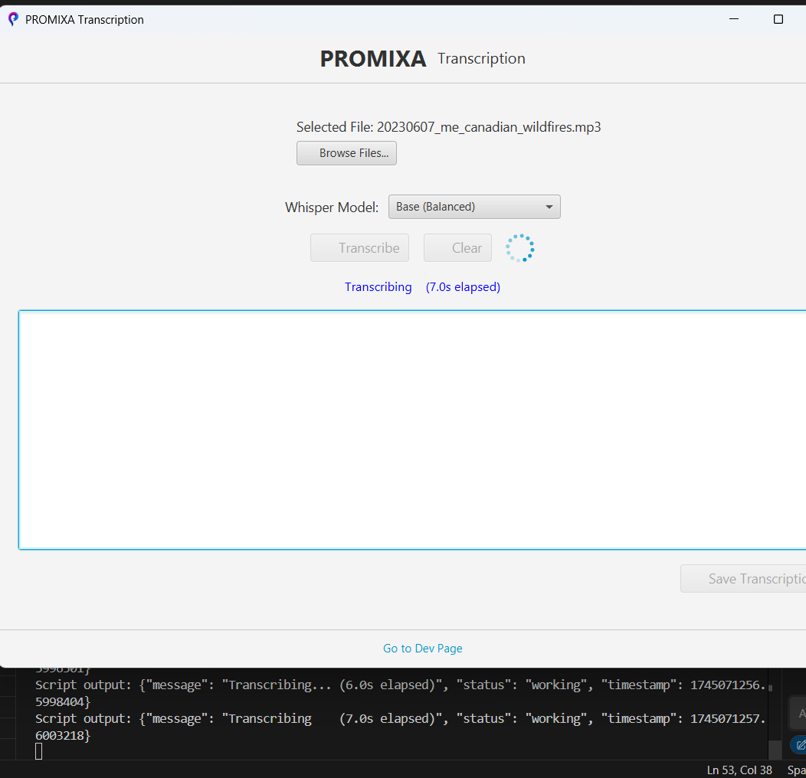
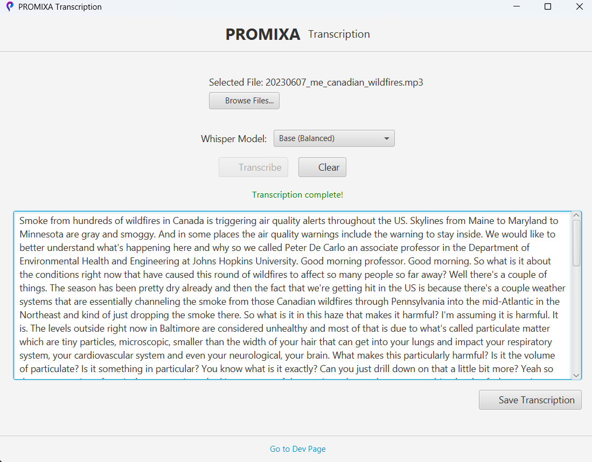

# PROMIXA Whisper Desktop Transcriber

 



## Features

- **One-click install & run**: No complex setup, just launch the app
- **User-friendly interface**: Modern, responsive, and intuitive
- **Drag & drop support**: Quickly add audio files
- **Multi-format support**: WAV, MP3, M4A, FLAC, and more
- **Model selection**: Choose from Whisper's Tiny, Base, Small, Medium, or Large models
- **Automatic model download**: Models are downloaded as needed inside the app
- **Progress feedback**: Real-time status and color-coded progress
- **Save results**: Export your transcript with a single click
- **Offline processing**: All transcription is local—no data leaves your computer
- **Cross-platform**: Works on Windows, macOS, and Linux (packaged .exe for Windows)

## Whisper Model Selection

PROMIXA lets you choose between different Whisper models:

| Model   | RAM Usage | Download Size | Speed      | Accuracy   |
|---------|-----------|--------------|------------|------------|
| Tiny    | Very Low  | ~75 MB       | Fastest    | Lower      |
| Base    | Low       | ~142 MB      | Fast       | Good       |
| Small   | Moderate  | ~462 MB      | Moderate   | Better     |
| Medium  | High      | ~1.5 GB      | Slower     | High       |
| Large   | Very High | ~2.9 GB      | Slowest    | Best       |

- **First time you select a model, it will be downloaded automatically.**
- **Larger models require more RAM and disk space, but provide higher accuracy and better results.**
- **You can switch models anytime in the app.**

## System Requirements

- **Windows 10/11** (macOS/Linux support coming soon)
- **No need to install Java or Python manually**—everything is bundled
- **At least 4GB RAM** (8GB+ recommended for Medium/Large models)
- **FFmpeg** (bundled or will be downloaded automatically)

## Installation & Quick Start

## Getting Started (macOS & Windows)

### 1. Clone the Repository

```sh
git clone https://github.com/mcavus10/promixa-transcribe-whisper-desktop.git
cd promixa-transcribe-whisper-desktop
```

### 2. Install Python Dependencies

```sh
cd src/main/python
pip install -r requirements.txt
```

### 3. Make Sure Java and Python Are Available
- **Java 17+**: Check with `java -version`
- **Python 3.8+**: Check with `python --version` or `python3 --version`
- **FFmpeg**: Check with `ffmpeg -version`

If any are missing, install them using your OS package manager or from their official websites.

### 4. Run the Application

Return to the project root and run:

```sh
mvn clean javafx:run
```

This will launch the PROMIXA Transcribe Desktop app. The JavaFX UI will appear and you can start transcribing audio files!

> **Tip:** On macOS, you may need to use `python3` instead of `python` and ensure FFmpeg is installed via Homebrew: `brew install ffmpeg`.

## Usage

1. **Open PROMIXA**
2. **Drag & drop** or **browse** to select your audio file
3. **Choose your Whisper model** (Tiny, Base, Small, Medium, Large)
4. **Click Transcribe**
5. **Wait for progress** (you'll see real-time status)
6. **Copy or save** your transcript when finished

> **Note:**
> - The first time you use a model, it will be downloaded automatically. This may take a few minutes depending on your internet speed and model size.
> - Larger models will use more RAM and disk space, but result in better transcription quality.

## Screenshot

> **Replace the placeholder below with your own screenshot!**


---

## Building Your Own .exe

PROMIXA is designed to be packaged as a single `.exe` file for Windows. If you want to build it yourself:

1. **Build the Python backend as an exe:**
   ```sh
   cd src/main/python
   pyinstaller --onefile whisper_script.py
   ```
2. **Build the Java frontend:**
   ```sh
   mvn clean package
   ```
3. **Bundle with jpackage:**
   ```sh
   jpackage \
     --type exe \
     --input target \
     --name PROMIXA \
     --main-jar promixa-desktop-0.1.0-SNAPSHOT.jar \
     --main-class com.promixa.MainApp \
     --icon src/main/resources/com/promixa/icons/app-icon.ico \
     --app-version 1.0 \
     --win-console \
     --add-modules javafx.controls,javafx.fxml \
     --resource-dir target/python
   ```
4. **Distribute the resulting PROMIXA.exe** to your users!

---

## Technical Details

- **Frontend**: JavaFX (Java 17+)
- **Backend**: Python 3.8+ (OpenAI Whisper, Torch, NumPy, FFmpeg)
- **Integration**: Java ProcessBuilder launches the Python exe for transcription
- **All processing is local**: No audio or text is ever uploaded

## License

MIT License

## Contributing

Pull requests are welcome! For major changes, please open an issue first to discuss what you would like to change.

## Acknowledgements

- [OpenAI Whisper](https://github.com/openai/whisper)
- [JavaFX](https://openjfx.io/)
- [PyInstaller](https://pyinstaller.org/)

---

## Repository Name Suggestion

**promixa-whisper-desktop**

> Short, descriptive, and easy to find for users searching for a desktop Whisper app.


## Troubleshooting

### Common Issues

1. **Python Not Found Error**
   - Ensure Python is installed and in your PATH
   - Try specifying the full path to the Python executable

2. **FFmpeg Not Found Error**
   - Install FFmpeg and ensure it's in your PATH
   - Restart the application after installing

3. **Whisper Model Download Issues**
   - Check your internet connection
   - The first run will download the model, which may take time

## License

[MIT License](LICENSE)

## Acknowledgments

- [OpenAI Whisper](https://github.com/openai/whisper) for the transcription model
- [JavaFX](https://openjfx.io/) for the UI framework
